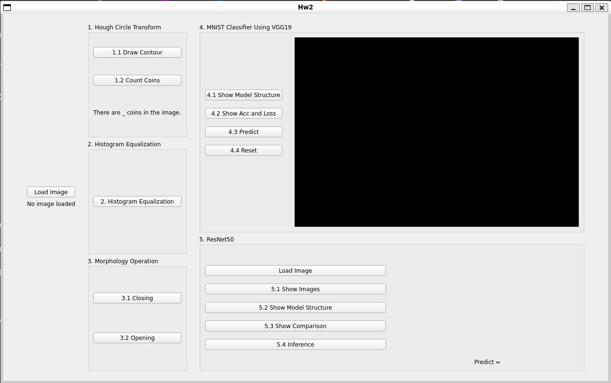

# 2023_Introduction_to_Image-Processing_Computer-Vision_and_Deep-Learning_HW1_in_NCKU

Implementation of a personal solution of the second homework in Introduction to Image Processing, Computer Vision, and Deep Learning courses in NCKU CSIE, 2023.

## Prerequisite

* Python 3.8

* Pip

## Environment

* Windows 11
* Ubuntu 20.04 WSL

## Get Started

Use

```bash
$ git clone https://github.com/dodo920306/2023_opencvdl_hw2_in_ncku.git
$ pip install -r requirements.txt
```

to clone the repo and install the prerequisites.

Run

```bash
$ ldd ~/.local/lib/python3.8/site-packages/PyQt5/Qt5/plugins/platforms/libqxcb.so | grep "not found"
```

to check if there are dependent shared libraries missing. It's usual that there's a lot of them.

Use

```bash
$ sudo apt update && sudo apt install <missing shared libraries> -y
```

to collect them.

For example, if you get

```bash
$ ldd ~/.local/lib/python3.8/site-packages/PyQt5/Qt5/plugins/platforms/libqxcb.so | grep "not found"
    libxcb-icccm.so.4 => not found
    libxcb-image.so.0 => not found
```

, run

```bash
$ sudo apt update && sudo apt install libxcb-icccm4 libxcb-image0 -y
```

in response.

The environment I used for develop this is WSL on Windows 11. If you're doing the same, please use

```bash
$ ipconfig
```

on Windows host to check its IP for the WSL.

You should be able to ping that IP from WSL. If you can't, please run

```bash
$ New-NetFirewallRule -DisplayName "WSL" -Direction Inbound -InterfaceAlias "vEthernet (WSL)" -Action Allow
```

as the administrator on Windows and try again.

Finally, run

```bash
$ python main.py
```

to start the program. You should see the window pop up on your screen.

You may encouter `Segmentation fault` when closing the window, it's normal. If you know how to fix it, please send pull request for it because I'm not sure how to solve that.

If you can actually ping Windows from WSL but still can't run main.py, please update your wsl, restart it, and try again.

## Functionality

Once you run main.py successfully, you should see some UI like this



As you can see, the features are divided into 5 main parts: Hough Circle Transformation, Histogram Equalization, Morphology Operation, VGG19, ResNet50

### Hough Circle Transformation

There are 2 buttons can be clicked providing 2 different features:

1. 

2. 

run

```bash
$ python Hough_Circle_Transformation.py
```

to get this part of UI independently.

### Histogram Equalization

There are 1 buttons can be clicked providing 1 feature:

1. 

2. 

run

```bash
$ python Histogram_Equalization.py
```

to get this part of UI independently.


### Morphology Operation

There are 2 buttons can be clicked providing 2 different features:

1. 

2. 

3. 

4. 

run

```bash
$ python Morphology_Operation.py
```

to get this part of UI independently.

### VGG19

run

```bash
$ python VGG19.py
```

to get this part of UI independently.

### ResNet50


run

```
$ python ResNet50.py
```

to get this part of UI independently.
